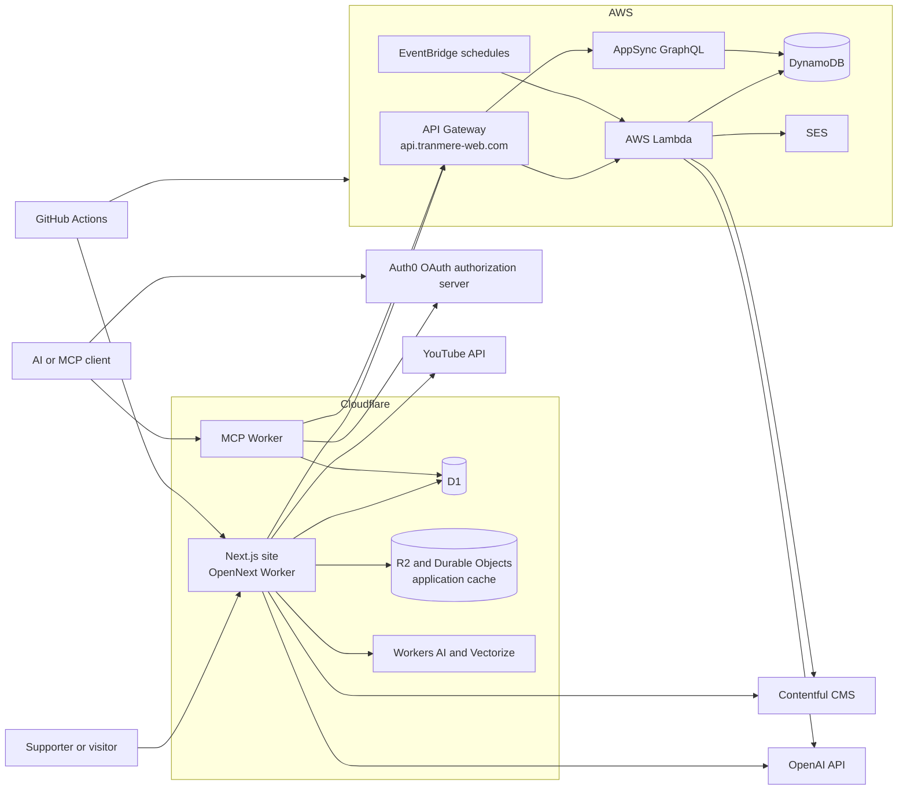

# Tranmere Web Architecture

## Purpose

Tranmere Web is an independent fan site about Tranmere Rovers, an English
football club. It brings together historical and current information about
players, matches, results, seasons, managers, transfers, shirts, records, and
club stories. It also provides interactive features such as player and result
searches, comments, AI-generated match reports, and an authenticated MCP API.

The application is a TypeScript monorepo. Its production architecture is split
across two cloud platforms:

- Cloudflare runs the public Next.js site and the optional Worker services.
- Cloudflare D1 stores migrated football entities and site-owned operational
  data.
- AWS runs legacy serverless APIs, editorial ingestion and supporting services.
  Historic match, appearance, goal and derived-statistics records are now held
  in D1.
- Contentful supplies editorial content and media.

## System context

## Repository layout

The root is a Yarn Classic workspace using Node.js 24.

| Workspace                 | Responsibility                                                                                |
| ------------------------- | --------------------------------------------------------------------------------------------- |
| `packages/site`           | Public Next.js website, UI components, server routes, and Cloudflare deployment configuration |
| `packages/api-stack`      | AWS CDK infrastructure, API Gateway, Lambda handlers, AppSync, scheduled jobs, and unit tests |
| `packages/lib`            | Shared football domain types, D1 entity types and read queries, mappings, and utilities       |
| `packages/tools`          | Reusable AI tools for matches, players, teams, results, lineups, managers, and transfers      |
| `packages/mcp`            | Auth0-protected Cloudflare MCP server exposing read-only D1 and match API tools               |
| `packages/vectorize`      | Worker for creating and querying player biography embeddings                                  |
| `packages/tidy`           | Scheduled Worker that removes old Cloudflare deployments                                      |
| `packages/scheduled-task` | Daily scheduled Worker that rebuilds player summaries and hat-tricks from D1 Apps and Goals   |
| `packages/sql`            | D1 schema, migrations, generated imports, and database commands                               |
| `packages/api-tests`      | Newman acceptance tests for deployed APIs                                                     |

`packages/site` and `packages/api-stack` form the main user-facing system. The
other workspaces provide shared code, administration, AI integrations,
maintenance, or testing.

## Frontend and edge runtime

The site in `packages/site` uses the Next.js App Router, React, and Tailwind CSS.
Routes are organized by the information supporters are looking for, including:

- articles and tagged editorial content;
- player profiles, player records, and player search;
- match pages, results, seasons, and scoring records;
- managers, transfers, hat-tricks, and historical shirts;
- interactive features such as the player builder, comments, and AI chat.

Pages use React Server Components by default and fetch data on the server. Some
interactive components run in the browser where client-side state or user input
is required.

OpenNext packages the Next.js application as a Cloudflare Worker. The production
configuration provides:

- static assets served by the Worker;
- an R2-backed incremental cache;
- a D1-backed Next.js cache-tag store;
- a Durable Object queue for cache revalidation;
- D1 access for players, clubs, managers, transfers, comments, ratings,
  corrections, and cache metadata;
- Workers AI and Vectorize bindings for AI features;
- the custom domain `www.tranmere-web.com`.

The site obtains its AWS API base URL from Cloudflare environment bindings.
Contentful and YouTube are called directly from server-side site code for
editorial content, images, shirts, and video playlists.

## D1 data services

Cloudflare D1 is the primary store for football entities that have been
migrated out of DynamoDB:

- `Players`, including profile fields, Markdown biographies, avatar links, and
  related links;
- `Clubs`;
- `Managers`;
- `Transfers`;
- `Games`, which hold canonical fixture, result, attendance, formation, kit,
  programme and match-metadata records;
- `MatchReports`;
- `Apps`, `Goals`, `PlayerSeasonSummaries` and `HatTricks`, which provide the
  match-event and player-statistics archive;
- `Programmes`, which catalogue digitised programme PDFs;
- submitted attendance, formation and player-profile corrections;
- comments and ratings.

The canonical schema and migrations live in `packages/sql`. Local and remote
databases are separate migration targets; applying or populating the remote
database is an explicit deployment operation.

Reusable D1 row contracts live in `packages/lib/src/d1-types.ts`. Shared,
read-only query builders live in `packages/lib/src/d1-queries.ts` and are used
by both the site and MCP Worker. Route-specific composition and administrative
write operations remain in `packages/site`.

## AWS API and remaining data services

The backend in `packages/api-stack` is defined with AWS CDK. API Gateway exposes
the public API at `api.tranmere-web.com` and sends requests to Node.js Lambda
functions.

The main REST capabilities are:

| Route                               | Responsibility                                    |
| ----------------------------------- | ------------------------------------------------- |
| `GET /player-search`                | Legacy player-search endpoint                     |
| `GET /result-search`                | Legacy result-search endpoint                     |
| `GET /match/{season}/{date}`        | Legacy match-event endpoint                       |
| `GET /page/{pageName}/{classifier}` | Assemble dynamic views such as player profiles    |
| `GET /report`                       | Return or generate match-report data              |
| `POST /media-sync/{type}`           | Synchronize media metadata                        |
| `POST /contact-us`                  | Send contact messages through Amazon SES          |
| `GET/POST /graphql`                 | Proxy selected AppSync queries and mutations      |

Lambda permissions are granted per function by the shared
`TranmereWebLambda` CDK construct. A handler receives read-only or read/write
access only to the DynamoDB tables it needs. API integrations and EventBridge
schedules are also attached by this construct.

Several EventBridge-triggered jobs remain available for legacy or editorial
workflows. The former player-summary and hat-trick jobs are retained for
compatibility; the Cloudflare scheduled task is now the authoritative daily
rebuild for their D1 data:

- player season summaries;
- hat-trick records;
- AI-assisted match reports.

AppSync and legacy Lambda paths still expose selected DynamoDB data. New site
code should read migrated football entities from D1. DynamoDB remains relevant
to legacy APIs and historical ingestion compatibility, but the site now uses
D1 for games, reports, appearances, goals, season summaries and hat-tricks.

The CDK stack imports existing DynamoDB tables by name or ARN. It does not own
the lifecycle of those tables, so deleting or replacing the stack does not
constitute a database migration strategy.

## Content and data ownership

The system separates editorial content from structured football statistics:

| Data                                                                                  | System of record                  | Typical consumers                      |
| ------------------------------------------------------------------------------------- | --------------------------------- | -------------------------------------- |
| Articles, shirt content, and editorial media                                          | Contentful                        | Next.js pages and some Lambda jobs     |
| Players, biographies, clubs, managers, transfers, games, match reports and programmes | Cloudflare D1                     | Site pages, administration, and MCP    |
| Comments, ratings, corrections, and Next.js cache tags                                | Cloudflare D1                     | Site routes, admin pages, and OpenNext |
| Appearances, goals, player-season summaries and hat-tricks                            | Cloudflare D1                     | Site pages, admin tools and scheduled task |
| Incremental-render cache                                                              | Cloudflare R2 and Durable Objects | OpenNext runtime                       |
| Player biography embeddings                                                           | Cloudflare Vectorize              | Experimental semantic search           |
| Static images, fonts, charts, and builder assets                                      | `packages/site/public`            | Browser via the site Worker            |

Shared interfaces in `packages/lib/src/tranmere-web-types.ts` describe the
football domain across packages. D1 row types and reusable SQL reads are also
owned by `packages/lib`. Shared mappings and utilities normalize player, team,
competition, image, and season data. This package is the closest thing to a
domain and read-data layer; it should remain independent of UI concerns.

## Typical request flows

### Viewing a player profile

1. A visitor requests `/page/player/{slug}` from the Cloudflare-hosted site.
2. The Next.js server component reads the player profile, transfer history,
   appearances, goals and season summaries from D1.
3. The site combines those records with related Contentful articles and renders
   the page.

### Viewing an article

1. A visitor requests `/page/blog/{slug}`.
2. Server-side site code queries the Contentful GraphQL API.
3. Next.js renders the rich-text article and referenced media or content blocks.
4. OpenNext caches the rendered result according to the Next.js cache settings.

### Viewing a match

1. A visitor requests `/match/{season}/{date}`.
2. The site reads the fixture, score, attendance, formation, kit, programme
   metadata and stored report from D1.
3. It reads player appearances, goals, cards and substitutions from D1 and
   renders the combined record with the best available formation-aware team
   sheet.
4. An approved attendance or formation correction updates the D1
   `Games` row.

### Using the MCP server

1. An MCP client discovers protected-resource metadata from
   `/.well-known/oauth-protected-resource/mcp`.
2. Auth0 authenticates the user through OAuth authorization code with PKCE. The
   production resource/audience is `https://mcp.tranmere-web.com/mcp`.
3. The client sends the Auth0 bearer token to the stateless Cloudflare Worker at
   `/mcp`.
4. The Worker verifies the RS256 signature, issuer, and exact audience.
5. `GetPlayers`, `GetClubs`, `GetTransfers`, `GetManagers` and `SearchResults`
   use the shared `packages/lib` D1 queries and return structured data through
   MCP.
6. `GetMatchByDate` reads match metadata, report, appearances, goals and
   substitutions from D1.
7. `GetPlayers` and `GetMatchByDate` link their results to versioned MCP Apps
   HTML resources, so compatible clients can render responsive player and match
   cards. The other tools remain data-only.
8. `CreatePlayerProfile` is a strict `write:players`-scoped operation that
   inserts a validated new player record into D1 after an exact-name duplicate
   check.
9. `CreateTransfer` is a strict `write:transfers`-scoped operation that uses
   canonical Clubs D1 data before inserting a validated, non-duplicate transfer
   record.

Auth0 user-delegated client grants control which third-party clients can obtain
tokens for the MCP audience. Tool scopes are advertised and enforced when
present. ChatGPT CIMD tokens currently arrive audience-bound without custom
scope claims, so a token with no permissions is accepted only after the issuer,
signature, and exact audience have been verified.

## AI features

AI is an enhancement rather than the primary source of football facts.

- AWS Lambda uses OpenAI and search tooling for generated match-report content.
- The site exposes an AI chat route and moderates submitted comments.
- `packages/tools` defines typed tools that retrieve factual match and player
  data for model-driven workflows.
- Cloudflare Workers AI and Vectorize support experimental semantic search over
  player biographies.

Generated output should remain distinguishable from sourced statistical and
editorial content. Secrets for model providers belong in deployment
configuration and must not be exposed to browser bundles.

## Deployment and operations

GitHub Actions deploys the two main runtime areas independently:

- Changes under `packages/site` build the OpenNext bundle and deploy it to
  Cloudflare.
- Changes under `packages/api-stack`, `packages/lib`, or `packages/api-tests`
  run AWS tests, deploy the CDK stack, add Datadog Lambda instrumentation, and
  run Newman acceptance tests.
- Changes under `packages/tidy` deploy its maintenance Worker.
- `packages/scheduled-task` runs at 23:00 UTC daily and rebuilds the D1
  `PlayerSeasonSummaries` and `HatTricks` tables from the `Apps` and `Goals`
  tables.
- `packages/mcp` has its own Cloudflare Worker build and deployment lifecycle;
  it binds directly to the production D1 database and uses Auth0 environment
  configuration.

Pull requests build the Cloudflare site as a deployment check. CodeQL and the
OpenSSF Scorecard workflows provide additional security checks. Dependabot
maintains npm and GitHub Actions dependencies.

The AWS API can be run locally by synthesizing the CDK stack and using AWS SAM.
The site runs locally with the Next.js development server. Local development
still requires suitable environment values, and features backed by Contentful,
AWS, Cloudflare, YouTube, or AI providers may require access to those external
services.

## Architectural boundaries and conventions

- Keep presentation and route composition in `packages/site`.
- Keep AWS resources and Lambda entry points in `packages/api-stack`.
- Put shared domain types, reusable D1 entity types, shared SQL reads, and
  platform-neutral football logic in `packages/lib`.
- Keep D1 schema and ordered migrations in `packages/sql`.
- Keep page-specific D1 composition and administrative writes in
  `packages/site`.
- Put reusable model tools in `packages/tools`; tools should retrieve facts from
  authoritative application services rather than duplicate storage logic.
- Treat Contentful as editorial storage, D1 as the system of record for migrated
  entities and match metadata, and DynamoDB as the store for remaining player
  event and statistical data.
- Access DynamoDB through Lambda or AppSync rather than directly from the
  browser.
- Access D1 from server-side Workers and route handlers, not browser bundles.
- Add Cloudflare-specific bindings to the appropriate Wrangler configuration
  and type them in the consuming workspace.
- Treat `.next`, `.open-next`, `.wrangler`, and `cdk.out` as generated output.
- Preserve least-privilege table grants when adding Lambda functions.

## Known architectural considerations

- The application spans Cloudflare, AWS, and several SaaS providers. A page may
  depend on more than one provider, so timeout, caching, and graceful-degradation
  behavior are important.
- DynamoDB tables are imported into the CDK stack rather than created there.
  Their schemas and lifecycle must be managed separately.
- The REST API is public and broadly CORS-enabled. New write operations should
  define authentication, authorization, validation, and rate-limiting
  requirements explicitly.
- Shared types are imported through workspace source paths in several places.
  Changes to `packages/lib` can therefore affect the site, Lambdas, and Workers
  at build time.
- D1 migration is incremental. Avoid reintroducing API reads for games,
  reports, apps, goals, player-season summaries or hat-tricks, which are now
  owned by D1.
- `packages/vectorize` and `packages/mcp` are adjacent services with their own
  deployment lifecycles; they are not required for the core website to serve
  standard fan content.
