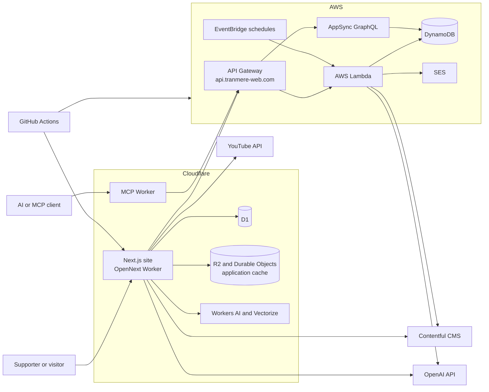

# Tranmere Web Architecture

## Purpose

Tranmere Web is an independent fan site about Tranmere Rovers, an English
football club. It brings together historical and current information about
players, matches, results, seasons, managers, transfers, shirts, records, and
club stories. It also provides interactive features such as player and result
searches, comments, AI-generated match reports, and a player-profile MCP tool.

The application is a TypeScript monorepo. Its production architecture is split
across two cloud platforms:

- Cloudflare runs the public Next.js site and the optional Worker services.
- AWS runs the serverless API and stores structured football data.
- Contentful supplies editorial content and media.

## System context

## Repository layout

The root is a Yarn Classic workspace using Node.js 24.

| Workspace            | Responsibility                                                                                |
| -------------------- | --------------------------------------------------------------------------------------------- |
| `packages/site`      | Public Next.js website, UI components, server routes, and Cloudflare deployment configuration |
| `packages/api-stack` | AWS CDK infrastructure, API Gateway, Lambda handlers, AppSync, scheduled jobs, and unit tests |
| `packages/lib`       | Shared football domain types, mappings, utilities, and data-access helpers                    |
| `packages/tools`     | Reusable AI tools for matches, players, teams, results, lineups, managers, and transfers      |
| `packages/mcp`       | Cloudflare-hosted Model Context Protocol server and player-profile widget                     |
| `packages/vectorize` | Worker for creating and querying player biography embeddings                                  |
| `packages/tidy`      | Scheduled Worker that removes old Cloudflare deployments                                      |
| `packages/sql`       | D1 schema and local database commands                                                         |
| `packages/api-tests` | Newman acceptance tests for deployed APIs                                                     |

`packages/site` and `packages/api-stack` form the main user-facing system. The
other workspaces provide shared code, administration, AI integrations,
maintenance, or testing.

## Frontend and edge runtime

The site in `packages/site` uses the Next.js App Router, React, and Tailwind CSS.
Routes are organized by the information supporters are looking for, including:

- articles and tagged editorial content;
- player profiles, player records, and player search;
- match pages, results, seasons, and scoring records;
- managers, transfers, hat-tricks, and historical shirts;
- interactive features such as the player builder, comments, and AI chat.

Pages use React Server Components by default and fetch data on the server. Some
interactive components run in the browser where client-side state or user input
is required.

OpenNext packages the Next.js application as a Cloudflare Worker. The production
configuration provides:

- static assets served by the Worker;
- an R2-backed incremental cache;
- a D1-backed Next.js cache-tag store;
- a Durable Object queue for cache revalidation;
- D1 access for application data such as comments;
- Workers AI and Vectorize bindings for AI features;
- the custom domain `www.tranmere-web.com`.

The site obtains its AWS API base URL from Cloudflare environment bindings.
Contentful and YouTube are called directly from server-side site code for
editorial content, images, shirts, and video playlists.

## AWS API and data services

The backend in `packages/api-stack` is defined with AWS CDK. API Gateway exposes
the public API at `api.tranmere-web.com` and sends requests to Node.js Lambda
functions.

The main REST capabilities are:

| Route                               | Responsibility                                 |
| ----------------------------------- | ---------------------------------------------- |
| `GET /player-search`                | Search and sort player and season-summary data |
| `GET /result-search`                | Search match results                           |
| `GET /transfer-search`              | Search player transfers                        |
| `GET /match/{season}/{date}`        | Assemble a complete match page                 |
| `GET /page/{pageName}/{classifier}` | Assemble dynamic views such as player profiles |
| `GET /report`                       | Return or generate match-report data           |
| `POST /media-sync/{type}`           | Synchronize media metadata                     |
| `POST /contact-us`                  | Send contact messages through Amazon SES       |
| `GET/POST /graphql`                 | Proxy selected AppSync queries and mutations   |

Lambda permissions are granted per function by the shared
`TranmereWebLambda` CDK construct. A handler receives read-only or read/write
access only to the DynamoDB tables it needs. API integrations and EventBridge
schedules are also attached by this construct.

Several EventBridge-triggered jobs maintain derived data:

- player season summaries;
- hat-trick records;
- “on this day” records;
- AI-assisted match reports.

AppSync provides a GraphQL view over selected DynamoDB tables, including clubs,
competitions, managers, players, links, transfers, stars, hat-tricks, matches,
and “on this day” data. Mutations are currently defined for player links and
transfers.

The CDK stack imports existing DynamoDB tables by name or ARN. It does not own
the lifecycle of those tables, so deleting or replacing the stack does not
constitute a database migration strategy.

## Content and data ownership

The system separates editorial content from structured football statistics:

| Data                                                                        | System of record                  | Typical consumers                             |
| --------------------------------------------------------------------------- | --------------------------------- | --------------------------------------------- |
| Articles, biographies, shirt content, and media                             | Contentful                        | Next.js pages and some Lambda jobs            |
| Players, appearances, goals, matches, transfers, clubs, and derived records | DynamoDB                          | Lambda handlers, AppSync, site pages, and MCP |
| Comments and Next.js cache tags                                             | Cloudflare D1                     | Site route handlers and OpenNext              |
| Incremental-render cache                                                    | Cloudflare R2 and Durable Objects | OpenNext runtime                              |
| Player biography embeddings                                                 | Cloudflare Vectorize              | Experimental semantic-search features         |
| Static images, fonts, charts, and builder assets                            | `packages/site/public`            | Browser via the site Worker                   |

Shared interfaces in `packages/lib/src/tranmere-web-types.ts` describe the
football domain across packages. Shared mappings and utilities normalize player,
team, competition, image, and season data. This package is the closest thing to
a domain layer; it should remain independent of UI concerns.

## Typical request flows

### Viewing a player profile

1. A visitor requests `/page/player/{slug}` from the Cloudflare-hosted site.
2. The Next.js server component calls
   `api.tranmere-web.com/page/player/{slug}`.
3. API Gateway invokes the dynamic-page Lambda.
4. The Lambda reads the relevant player, appearance, goal, transfer, link, and
   season-summary records from DynamoDB.
5. The site combines that response with related Contentful articles and renders
   the page.

### Viewing an article

1. A visitor requests `/page/blog/{slug}`.
2. Server-side site code queries the Contentful GraphQL API.
3. Next.js renders the rich-text article and referenced media or content blocks.
4. OpenNext caches the rendered result according to the Next.js cache settings.

### Using the MCP player tool

1. An MCP client connects to the Cloudflare Worker over `/mcp` or `/sse`.
2. The tool calls the public AWS player-profile endpoint.
3. The Worker returns structured player information.
4. Compatible clients can render the bundled React profile widget.

## AI features

AI is an enhancement rather than the primary source of football facts.

- AWS Lambda uses OpenAI and search tooling for generated match-report content.
- The site exposes an AI chat route and moderates submitted comments.
- `packages/tools` defines typed tools that retrieve factual match and player
  data for model-driven workflows.
- Cloudflare Workers AI and Vectorize support experimental semantic search over
  player biographies.

Generated output should remain distinguishable from sourced statistical and
editorial content. Secrets for model providers belong in deployment
configuration and must not be exposed to browser bundles.

## Deployment and operations

GitHub Actions deploys the two main runtime areas independently:

- Changes under `packages/site` build the OpenNext bundle and deploy it to
  Cloudflare.
- Changes under `packages/api-stack`, `packages/lib`, or `packages/api-tests`
  run AWS tests, deploy the CDK stack, add Datadog Lambda instrumentation, and
  run Newman acceptance tests.
- Changes under `packages/tidy` deploy its maintenance Worker.

Pull requests build the Cloudflare site as a deployment check. CodeQL and the
OpenSSF Scorecard workflows provide additional security checks. Dependabot
maintains npm and GitHub Actions dependencies.

The AWS API can be run locally by synthesizing the CDK stack and using AWS SAM.
The site runs locally with the Next.js development server. Local development
still requires suitable environment values, and features backed by Contentful,
AWS, Cloudflare, YouTube, or AI providers may require access to those external
services.

## Architectural boundaries and conventions

- Keep presentation and route composition in `packages/site`.
- Keep AWS resources and Lambda entry points in `packages/api-stack`.
- Put shared domain types and platform-neutral football logic in `packages/lib`.
- Put reusable model tools in `packages/tools`; tools should retrieve facts from
  authoritative application services rather than duplicate storage logic.
- Treat Contentful as editorial storage and DynamoDB as structured football
  storage.
- Access DynamoDB through Lambda or AppSync rather than directly from the
  browser.
- Add Cloudflare-specific bindings to the appropriate Wrangler configuration
  and type them in the consuming workspace.
- Treat `.next`, `.open-next`, `.wrangler`, and `cdk.out` as generated output.
- Preserve least-privilege table grants when adding Lambda functions.

## Known architectural considerations

- The application spans Cloudflare, AWS, and several SaaS providers. A page may
  depend on more than one provider, so timeout, caching, and graceful-degradation
  behavior are important.
- DynamoDB tables are imported into the CDK stack rather than created there.
  Their schemas and lifecycle must be managed separately.
- The REST API is public and broadly CORS-enabled. New write operations should
  define authentication, authorization, validation, and rate-limiting
  requirements explicitly.
- Shared types are imported through workspace source paths in several places.
  Changes to `packages/lib` can therefore affect the site, Lambdas, and Workers
  at build time.
- `packages/vectorize` and `packages/mcp` are adjacent services with their own
  deployment lifecycles; they are not required for the core website to serve
  standard fan content.
